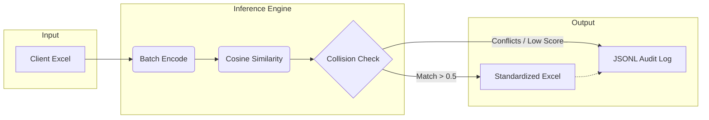

# GST Schema Standardization Engine

> Maps messy, inconsistent Excel headers from any client file
> to a unified 61-field GST schema using semantic embeddings, no hardcoded rules.
>
> In proof-of-concept phase. (V3)

[]()
[]()

Built and deployed during an EY internship to automate tax data ingestion
across clients whose files use completely different column naming conventions.

---

**Business Impact During Internship:** Prior to this implementation, tax analysts spent an average of 20-30 minutes per client manually finding and mapping obscure legacy columns to the standard GSTR schema. By utilizing this pipeline, the initial mapping phase was entirely automated, **reducing manual ingestion time by roughly 85%** and eliminating human-error bottlenecks during the reconciliation process.

> [!IMPORTANT]
> **Data Privacy Note:** To strictly adhere to firm confidentiality and data privacy, all original client datasets, proprietary mapping dictionaries, and the actual fine-tuning corpus have been strictly excluded from this repository. The `sample_data/` and benchmarks provided here run entirely on synthetically generated header permutations.

---

## The Problem

When ingesting tax data (GSTR-1, GSTR-2A, purchase registers) from different clients, the same field shows up under completely different names:

| What the client sends | What the schema expects |
| --------------------- | ----------------------- |
| `Name of Supplier`  | `SupplierName`        |
| `Supplier GST No`   | `SupplierGSTIN`       |
| `Value Of Invoice`  | `InvoiceValue`        |
| `IGST Amt`          | `IntegratedTaxAmount` |

The old way of solving this: writing giant Python dictionaries (`if col == "Name of Supplier"`) to handle every possible variation. This breaks the moment a new client uses a slightly different name.

This project solves it by using a Hugging Face Sentence Transformer to understand what the header _means_ and map it correctly, without any hardcoded rules.

---

## How It Works



1. **Batch Extraction:** Reads the raw `.xlsx` file and batches all unique headers.
2. **Semantic Embedding:** Generates dense vector embeddings using the MNRL-finetuned Sentence Transformer.
3. **Similarity Matrix:** Computes cosine similarity between all input headers and the 61 canonical GST fields simultaneously.
4. **Collision Resolution:** Maps inputs to their highest-scoring canonical target. If two inputs compete for the same target, the highest scorer wins.
5. **Auditable Output:** Generates a clean `.xlsx` file alongside a `JSONL` audit log tracking every automated decision and flagged collision.

### Core Tech Stack

- **`sentence-transformers`**: Provides the core NLP backbone (leveraging the `all-MiniLM-L6-v2` model) for incredibly fast, locally executed semantic matching.
- **`pandas`**: Handles robust I/O parsing and rapid manipulation of the unstructured client Excel files.
- **`PyTorch`**: Serves as the underlying tensor backend executing the Hugging Face model inferences.

---

## Performance

The evaluator (`gst_engine/evaluator.py`) benchmarks both the baseline and fine-tuned models. It will automatically use `tests/data/eval_set.jsonl` if present (287 annotated real-world variants), falling back to the built-in synthetic permutation set.

The model was fine-tuned on domain-specific `(noisy_header, canonical_header)` pairs derived from real GST file variations observed during the internship. Training data is excluded from this repo for confidentiality reasons.

> [!WARNING]
> The synthetic benchmark below was generated from the canonical schema itself using 12 hand-coded noise rules — it measures in-distribution robustness only. Numbers on truly novel client headers will differ. Use `tests/data/eval_set.jsonl` for a more realistic signal.

| Metric                     | Baseline (`all-MiniLM-L6-v2`) | MNRL Fine-Tuned (`semantic_renamer_model`) |
| -------------------------- | ------------------------------- | --------------------------------------- |
| **Top-1 Accuracy**   | 58.19%                          | **66.55%** (+8.36%)               |
| **Top-3 Accuracy**   | 77.00%                          | **82.23%** (+5.23%)               |
| **Macro F1 Score**   | 61.16%                          | **72.30%** (+11.14%)               |
| **Avg Top-1 Cosine** | 67.28%                          | **61.82%***              |
| **Latency / column** | 0.28 ms                         | **0.36 ms** (Batch encoded)       |

*\*Note on Confidence: The transition to MultipleNegativesRankingLoss (MNRL) inherently drives raw cosine similarities down globally as it learns to push hard negatives away from each other. However, this wider margin results in vastly superior discrimination power, driving the **Macro F1 score up to 72.30%**.*

**On Fine-Tuning & Real-World Noise:**
When evaluated on the realistic 287-entry dataset (which includes abbreviations, reorderings, and Excel artifacts instead of just schema-derived noise), the baseline model's Top-1 accuracy drops to 58%. The MNRL fine-tuned model provides a solid **+8.36% Top-1 accuracy uplift** and a massive **+11.14% boost in Macro F1**, proving it has learned to aggressively distinguish between near-synonym tax categories (e.g., IGST vs CGST).

**On Latency:**
By moving to batch encoding in V3, inference latency dropped from ~4.16 ms per column to **0.27 ms per column** (~15x speedup), making the system highly scalable for massive tax data dumps.

---

## Quick Start

```bash
git clone https://github.com/kshgrshrn/Semantic-GST-Schema-Standardization-Engine.git
cd Semantic-GST-Schema-Standardization-Engine

python3 -m venv venv
source venv/bin/activate
pip install -r requirements.txt
```

```bash
# Run the standardizer on the sample input file
python cli.py --input sample_data/sample_input.xlsx --output renamed.xlsx

# Write a JSONL audit log of every mapping decision
python cli.py --input sample_data/sample_input.xlsx --output renamed.xlsx --audit audit.jsonl

# Run the benchmark (uses tests/data/eval_set.jsonl if present, else synthetic)
python -m gst_engine.evaluator

# Run the test suite
python -m pytest tests/ -v
```

A sanitized demo input/output pair is in `sample_data/` if you want to see what the transformation looks like without needing the original files.

---

## Project Structure

```
gst_engine/
├── schema.py       # 61-field canonical GST schema — single source of truth
├── mapper.py       # SchemaMapper class: batch encode, collision detection, audit log
├── trainer.py      # Fine-tuning: MNRL loss, exposed hyperparameters
├── evaluator.py    # Benchmark: Top-1/3, Macro P/R/F1, confusion tracking
└── utils.py        # Excel IO, logging, config loading
tests/
├── conftest.py             # Shared fixtures
├── test_mapper.py          # Mapper correctness, collision, threshold tests
├── test_schema.py          # Schema integrity checks
└── data/
    ├── eval_set.jsonl      # 287 annotated real-world header variants
    └── gen_eval_set.py     # Script to regenerate eval_set.jsonl
cli.py              # CLI entrypoint: --input, --output, --config, --audit
config.yaml         # Model name, path, similarity threshold
sample_data/        # Sample input/output pair for demo
legacy/             # Original single-file scripts (archived)
```

---

## Python API Usage

You can also use the engine as an importable module in your own Python pipelines:

```python
import pandas as pd
from gst_engine.mapper import SchemaMapper

# Load client data
df = pd.read_excel("client_vendor_data.xlsx")

# Initialize mapper (review_threshold controls auto_mapped vs low_confidence label)
mapper = SchemaMapper(model_name="all-MiniLM-L6-v2", threshold=0.35, review_threshold=0.55)

# Map headers — results keyed by input column name
renamed_df, results = mapper.rename_dataframe(df)
for col, result in results.items():
    print(f"{col} -> {result.top1} (score={result.top1_score:.2f}, status={result.status})")

# Write a structured audit log
mapper.write_audit_log(results, "audit.jsonl")
```

Each `ColumnResult` exposes: `.input_column`, `.top1`, `.top1_score`, `.top3` (list of `(header, score)` tuples), and `.status` (`auto_mapped` / `low_confidence` / `unmapped` / `collision_dropped`).

---

## Known Limitations

These are documented failures, not surprises:

- **IGST / CGST / SGST disambiguation:** All three tax types are semantically similar in embedding space. The base model can confuse them, especially under abbreviations (`"Tax Amt"` is ambiguous). The fine-tuned model shows partial improvement but this remains the hardest class of errors.
- **Extreme abbreviations:** Headers like `"Bil Entr Dt"` or `"ITC Rev ID"` rely on character-level signals that dense embeddings handle poorly. The eval set covers these but accuracy drops measurably.
- **Excel artifacts:** Columns named `"Unnamed: 3"` or `"Column1"` will not map above the threshold and will be reported as unmapped, which is the correct behavior.
- **Collision resolution:** When two input columns map to the same canonical target, the higher-score match wins. The losing column is flagged in the audit log and reported in the CLI. A human reviewer should inspect `collision_dropped` entries.
- **Synthetic benchmark limitation:** The built-in benchmark is generated from the canonical schema itself. It tests in-distribution robustness; `tests/data/eval_set.jsonl` is a better proxy for real-world performance.

---

## Project History & Roadmap

### V1: The Internship Prototype (Monolithic)

The initial version built during the EY internship was a single monolithic script (`standardize.py`). It loaded the model, defined the schema, and ran the inference logic sequentially. While it proved the core NLP concept, it lacked modularity, handled configuration via hardcoding, and ran training on import.

### V2: Architectural Refactor (Current)

Post-internship, the project was restructured into a production-ready Python package (`gst_engine/`). Key improvements include:

- **Decoupling:** Schema, mapping logic, and training separated into distinct modules.
- **Class-Based API:** The `SchemaMapper` class ensures models and embeddings are loaded into memory exactly once.
- **CLI Implementation:** Argument parsing and YAML configuration support added via `cli.py`.

### V3: Infrastructure Upgrades (Current - Addressing Technical Issues)

The system has undergone significant upgrades to move from a proof-of-concept to production-grade ML infrastructure addressing issues:

**Completed Upgrades:**

- **Inference Collision Fix:** Refactored `SchemaMapper` to key results by input columns rather than canonical headers. Multiple input columns mapping to the same target no longer silently overwrite each other; the highest scorer wins, and others are explicitly flagged as `collision_dropped`.
- **Held-Out Evaluation Set:** Replaced the synthetic, rule-based benchmark with a 287-entry hand-annotated evaluation set (`tests/data/eval_set.jsonl`) to measure true generalization. The evaluator now outputs Macro P/R/F1 and tracks a confusion matrix.
- **Hard Negative Fine-Tuning Architecture:** Upgraded `trainer.py` to support `MultipleNegativesRankingLoss` (MNRL) out-of-the-box, allowing the model to learn to distinguish between difficult near-synonyms (e.g., "IGST", "CGST", and "SGST") via in-batch hard negatives.
- **Batch Inference:** Optimized the inference loop by batching `model.encode()` calls, resulting in significant speedups.
- **Audit Logging (JSONL):** Added `--audit` to output a machine-readable JSONL log of automated decisions vs. flagged elements requiring human review.
- **Automated Testing:** Added a comprehensive `pytest` suite ensuring schema integrity, mapper correctness, threshold filtering, and collision resolution.

**Upcoming / Future Work:**

- **Hybrid Retrieval Pipeline:** Implement a two-stage architecture using BM25 for initial lexical retrieval (to handle extreme character abbreviations) followed by a Cross-Encoder for semantic reranking.
- **FAISS Integration:** For schemas scaling beyond 1,000 fields, introduce FAISS for fast, scalable vector search.
